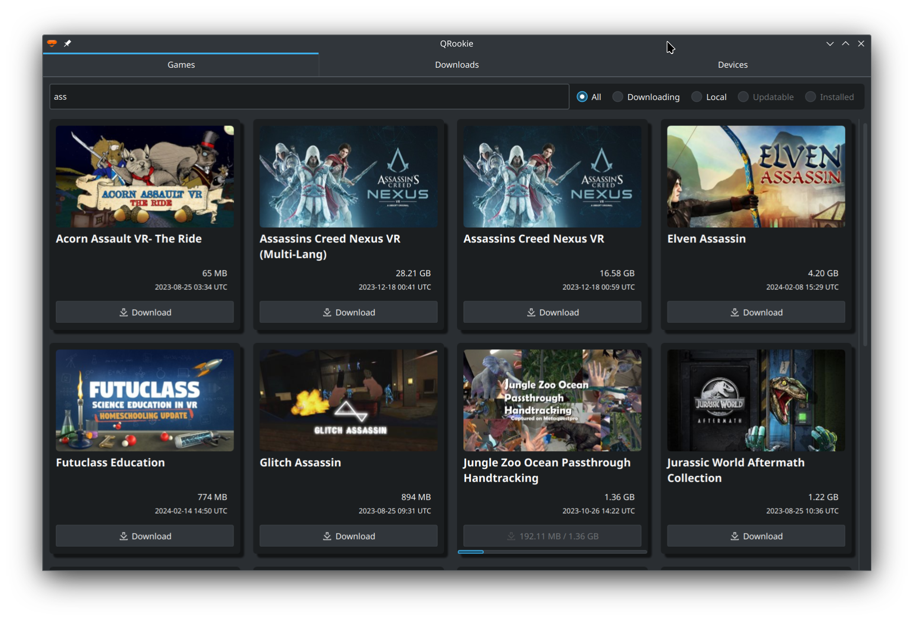

#  QRookie 
Download and install Quest games from ROOKIE Public Mirror (like [VRP Rookie Sideloader](https://github.com/VRPirates/rookie) but for linux).

# Screenshots

 


# Download

## Arch Linux 

 


### Install from AUR
```shell
paru -S qrookie-vrp
```

## SteamOS And Other Linux
Now there is only a flatpak package, which can run on almost all linux distributions, including SteamOS (Steam Deck).

### Flathub
 

<a href='https://flathub.org/apps/io.github.glaumar.QRookie'>
    
</a>

### Flatpak Bundle
 


See [releases](https://github.com/glaumar/QRookie/releases).


# FAQ

## 1. Game installation failed?
QRookie currently does not support `install.txt`. Some games may fail to install or may not run after installation. You can find the downloaded games in `~/.var/app/io.github.glaumar.QRookie/data/QRookie/` and manually install them ([Manual-Sideloading](https://vrpirates.wiki/en/Howto/Manual-Sideloading)).

## 2. Are all the games provided by QRookie? Are these games infected with viruses?

No, QRookie does not provide any games. It is just a downloader that downloads games from public servers. QRookie does not know what it is downloading, and it does not check whether the downloaded content is a legitimate game or a virus. **To ensure the safety of your VR device, please do not use QRookie** .

---

